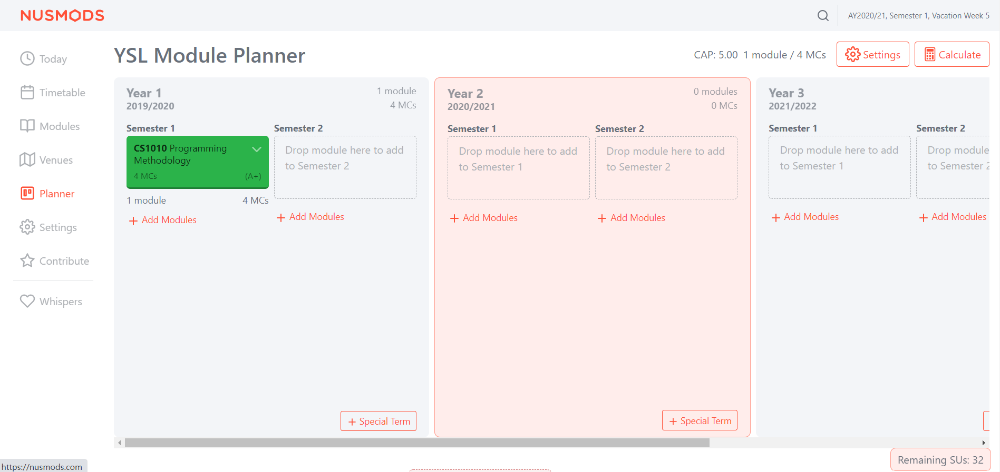
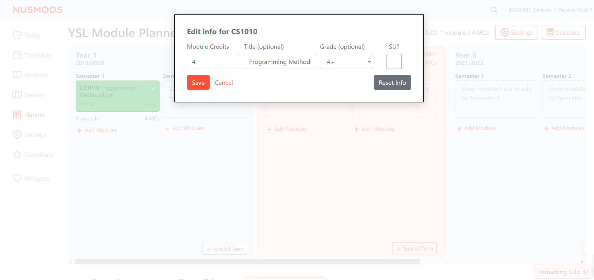

# CAP/SU

CAP/SU is a **browser extension for managing SUs, CAP alongside with NUSMOD Module Planner**
Targeted at NUS students, CAP/SU can help you plan you college study plans conveniently and keep your academic record.

* Table of Contents
{:toc}

--------------------------------------------------------------------------------------------------------------------

## Quick start

1. Ensure you have Google Chrome `Version 87.0` or above installed in your Computer.

2. Access the latest `CAP/SU` from [here](https://github.com/YSL-hack-roll/Module-Planner/releases/tag/v0.2).

3. Deploy it to your chrome browser.

4. Open [NUSMOD](https://nusmods.com/), access Settings > NUSMods Beta > Turn it ON, then access [NUSMOD-Planner](https://nusmods.com/planner).
   

5. Click `Add Modules` to add new modules to the planner.

6. Click `Edit MC and Title` to Enter/Modify Module Credits, Title, Grade, and SU or not.

7. Double Click the colored box of a module to change its SU option.
   
8. CAP is shown on the top right corner and Remaining SUs is shown at the bottom right corner.

--------------------------------------------------------------------------------------------------------------------

## Features

#### Grade Selection

Records student's respective grades of the modules that they have taken.

Usage: 

1. Click `Add Modules` to add a module. 

2. Click the drop down list of a module box and click `Edit MC and Title`. 

3. Click the drop down list of grade and select the respective grade. 

4. For modules which are available for SUs, click the checkbox to change the SU option.

5. The remaining SU MCs are shown at the bottom right corner.

#### Automatic CAP Calculation

Automatically calculates the CAP of a student based on the module information that they have entered. The CAP is shown at the top right corner.

Usage:

1. Add module(s) and they respective grade & SU option. 

2. The calculated CAP is shown at the top right corner. The default CAP is 0.0 when graded MCs is 0.

#### Easy SU

Conveniently allows students to compare they CAP differences when they are considering whether to SU a module. 

Usage: 

1. Double click the module card, the SU option of the module is toggled.

2. The color of the module card is changed, blue cards are modules that SU has been used and the green cards are normally graded modules.

3. The new CAP is refreshed and shown at the top right corner.

